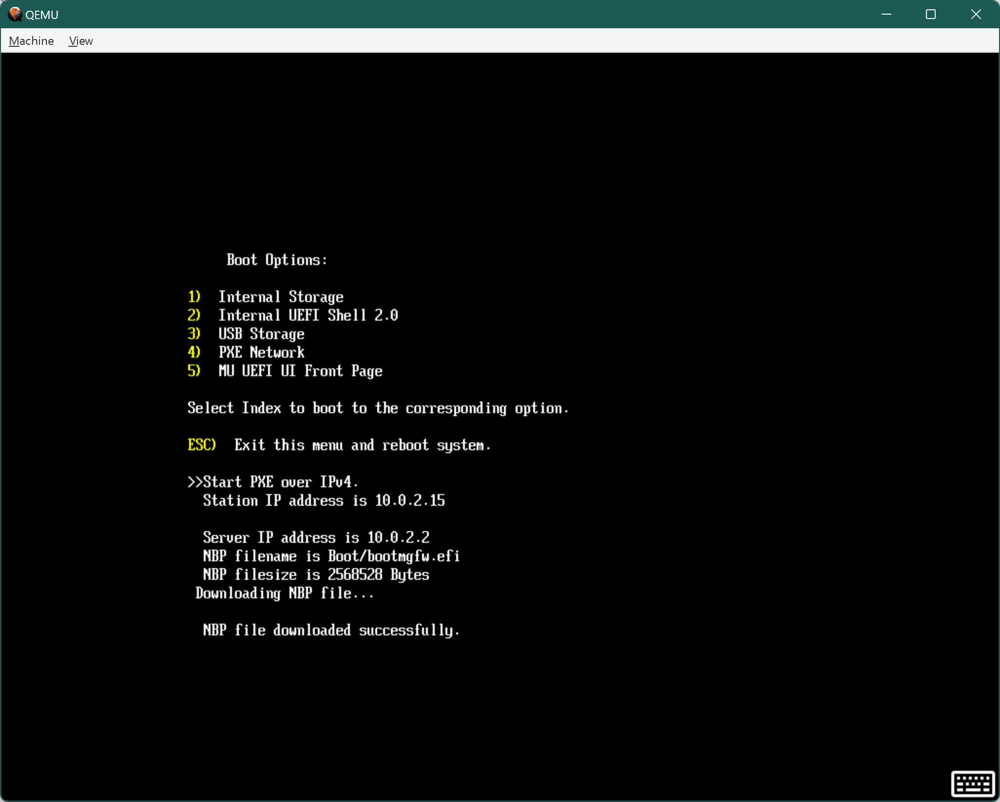

# PXE Boot Emulation

PXE Boot is a standard feature to boot an agent via network. A detailed rundown can be found at this [Tianocore page](https://github.com/tianocore/tianocore.github.io/wiki/PXE).

## PXE Boot Preparation

QEMU supports TFTP server hosting, which allows us to PXE boot a QEMU VM. To do this, one would need a prepared PXE folder
available to the QEMU launching instance.

For more detailed information on preparing a folder for booting Windows PE PXE boot, please refer to the
[Microsoft PXE server setup documentation](https://learn.microsoft.com/en-us/windows/deployment/configure-a-pxe-server-to-load-windows-pe).

*Note*: when preparing for the BCD, please use the following command to point the correct boot loader to the following
efi file (instead of the exe file as mentioned in the documentation):

```bash
bcdedit.exe /store c:\BCD /set {GUID1} path \windows\system32\winload.efi
```

## Enable PXE Boot

To enable the QEMU PXE boot option, please specify the following parameters, either through command line or through the
`BuildConfig.conf` file:

| Name | Usage | Example |
| --- | --- | --- |
| `PXE_BOOT` | Flag to enable PXE booting | `PXE_BOOT=TRUE` |
| `PXE_FOLDER_PATH` | Folder path to the prepared PXE boot files | `PXE_FOLDER_PATH="D:\\"` |
| `PXE_BOOT_FILE` | File path to the initial download | `PXE_BOOT_FILE="Boot/bootmgfw.efi"` |

This will allow the QEMU to set up a TFTP server and reply a default boot file to download when PXE boot is requested.
The network driver in this case is set to e1000.

Once the system booted, the default boot option will land in the UEFI Shell. One can exit the UEFI shell and select the
Boot Options from the boot menu and choose to PXE boot from there.



## Troubleshooting Tips

### Network Traffic

QEMU has provided a way of collecting network traffic. To do so, one can append the following parameter to the QEMU launching
command in [QemuRunner.py](../../../QemuQ35Pkg/Plugins/QemuRunner/QemuRunner.py#L88):

```py
"-object filter-dump,id=f1,netdev=net0,file=dump.dat"
```

Where the `dump.dat`, of which name is subject to users' choice, is the file to store the network traffic. This file can
be opened by Wireshark to analyze the network traffic.

### Customized PXE Driver

QEMU leverages iPXE as the NIC driver for its e1000 device. To customize the iPXE driver, i.e. in the case of updating the
driver to enable NX flag and/or paging alignment, one can follow the steps below:

- One can refer to the QEMU usage for building iPXE from their make file [here](https://github.com/qemu/qemu/blob/master/roms/Makefile).
However, it is essentially doing the following, where the output *.efirom will be our target. Note that one will need
EfiRom from our [BaseTools](https://github.com/microsoft/mu_basecore/tree/release/202302/BaseTools) for the below
commands to work:

```bash
cd ipxe/src
make veryclean
make bin-x86_64-efi/8086100e.efidrv -j 4 CONFIG=qemu
cd ../..
MU_BASECORE/BaseTools/Bin/Mu-Basetools_extdep/Linux-x86/EfiRom -f "0x8086" -i "0x100e" -l 0x02 -ec bin-x86_64-efi/8086100e.efidrv -o bin-x86_64-efi/8086100e.efirom
```

- Once we have our own NIC driver, to apply the new option rom to the QEMU launching instance, one can specify the following
parameter in [QemuRunner.py](../../../QemuQ35Pkg/Plugins/QemuRunner/QemuRunner.py#L88) when configuring the netowork device:

```py
",romfile=<path_to_your_8086100e.efirom>"
```
